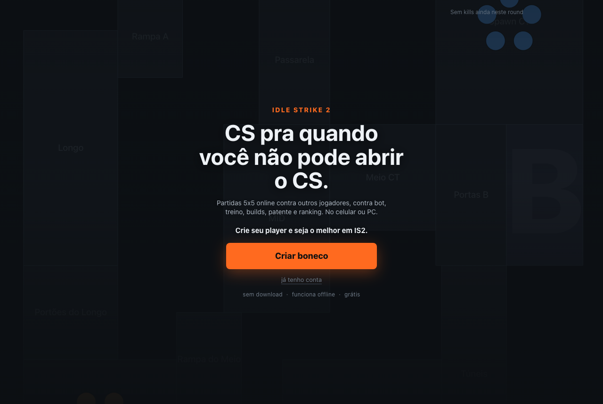

# Idle Strike 2



**CS pra quem não pode abrir o CS agora.** Você cria um boneco, evolui atributos e build de cartas, e assiste ele jogar partidas 5x5 simuladas numa tela estilo HLTV Live (radar, kill feed, scoreboard), com um minigame de mira sincronizado aos duelos dele. Tem treino, deathmatch, queue contra bots, queue online, patente, ranking e x1 (contra bot ou amigo). Roda no celular e no PC, como PWA.

Jogar: **<https://browserstrike2.vercel.app>**

## Rodar local

```bash
git clone https://github.com/leolatance/browserstrike2.git
cd browserstrike2
npm i
npm run dev
```

Abre em `http://localhost:5173`. **Sem Supabase, tudo funciona**: boneco, treino, DM, queue solo contra bots, cartas, x1 contra bot. É intencional — a Fase 1 é 100% local (IndexedDB) e o online é opcional por cima.

## Rodar com online

Copie `.env.example` pra `apps/web/.env.local` com a URL e a anon key de um projeto Supabase seu, e siga o [supabase/README.md](supabase/README.md) (migrações, functions, cron). O projeto de produção é do autor.

## Estrutura

```
packages/engine/   simulação determinística em TS puro (seed → log de eventos); dados de jogo em data/
apps/web/          React + Vite PWA: telas, radar em canvas, minigames, Dexie, cliente Supabase
supabase/          migrações SQL, edge functions (Deno) e o README pra subir seu projeto
docs/              GDD.md (cânone do jogo), SKINS.md, imagens
scripts/           bundle do engine pra Deno, OG image
.github/           CI, template de PR, rascunhos das issues iniciais
```

## Como o projeto decide

- `docs/GDD.md` é o **cânone**: se está lá, é assim que o jogo funciona. Mudou o jogo, muda o GDD no mesmo PR.
- `CLAUDE.md` são as **regras de engenharia** (determinismo, dados em tabela, sem DOM no engine, IP).
- `packages/engine/test/balance.test.ts` é **lei**: milhares de partidas por cenário com faixas fechadas. PR que quebra um gate não entra.
- Decisão de design passa por **issue antes de código**, citando o item do GDD. Veja o [CONTRIBUTING.md](CONTRIBUTING.md).

## Onde eu travei

Motor, online e progressão eu consegui tocar. Onde travei foi no visual das skins: tenho 17 padrões prontos ([docs/SKINS.md](docs/SKINS.md)), gerei renders por IA e não gostei do resultado. A direção de arte das skins está em aberto — se você tem olho pra isso, a issue é sua.

Também aceito ajuda em: arte das 30 cartas, ícones das 10 patentes (SVG), um segundo mapa.

## Licença

Código aberto: clona, roda, modifica, contribui. Comercial fica comigo. O nome e as artes são do projeto. PR passa por um CLA de duas frases.

Formalmente: o código está sob a [PolyForm Noncommercial 1.0.0](LICENSE) — pode estudar, rodar, modificar e contribuir; uso comercial é reservado ao autor. O nome "Idle Strike 2", o logo, as skins e os renders ficam fora da licença. Contribuições passam pelo [CLA.md](CLA.md).

## Roadmap

GitHub Project **Roadmap**: <https://github.com/users/leolatance/projects> — as issues iniciais estão em [.github/ISSUE_DRAFTS](.github/ISSUE_DRAFTS).

## Pra quem mantém: proteção da `main`

Em **Settings → Branches → Add branch ruleset** (ou *branch protection rule*) pra `main`: exigir pull request antes de merge, exigir status checks (`typecheck · engine (sem balance) · web · build`, `edge functions (Deno)`, `CLA aceito no PR`), bloquear force-push. Deploy continua manual, só por `vercel deploy --prod` do autor — a Vercel **não** é conectada ao GitHub.
